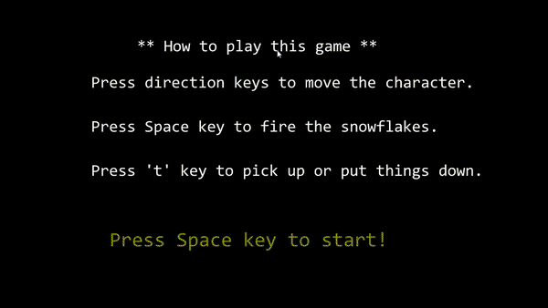
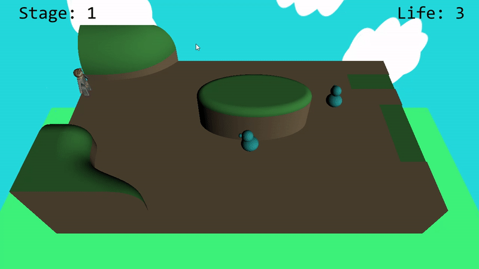
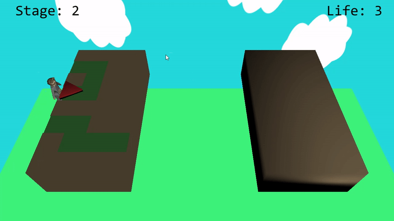
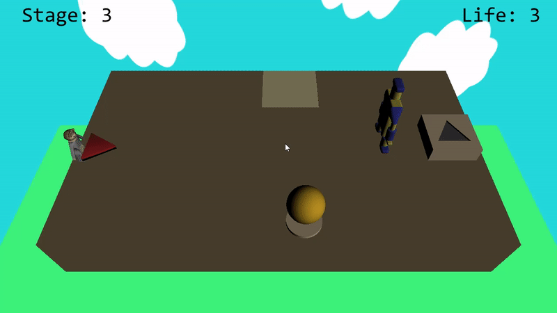

# Computer Graphics Team Project - Woori's Adventure
The goal of this team project is implementing a game that uses OpenGL for main graphics API.

## Title image

## How to Play?

    ◻ Choose your character and difficulty level

## 1. Basic Control

    ◻ If a player press the direction key, the character moves up and down, right and left.
    ◻ The character can use snow particle by space bar.

## 2. Map1

    ◻ You have to defeat all ducks to get a key and then can go to next map.
    ◻ If you go out of the map, you will fall, and your life time will be decreased.
    ◻ If you press ‘F1’ key, you can see the graphical help.

| Easy Mode | Hard Mode |
| --------- | --------- |
|  |  |

    ◻ In easy mode, ducks move their own route regardless of character’s movement.
    ◻ In hard mode, ducks will chase the player.

    ◻ If you defeats all ducks, you can acquire triangle key.
    ◻ You can pick it up by ‘t’ key. If you press ‘t’ key again, you can put it down.

## 3. Map2

    ◻ To clear the second map, you have to find a hidden hint in the game.
    ◻ If you just try to cross the land, you will fall. It can be hard to find the bridge, so you can see the hint again by pressing F1 key.
    ◻ In easy mode, we set the boundary for you to not fall off the bridge, so you can easily pass the bridge.

## 4. Map3

    ◻ On the final map, you should give a boss slip to put your key since the boss is so fast and never die.

## Contributer
1. hanwoolsky (Hanwool Huh)
2. SungSubKim (SeongSeob Kim)
3. Onebellfortune (JongUn Han)

## CopyRight
> All rights (3D Models, image, background music) reserved to hanwoolsky.

> Most of header files are provided by Prof Sungkil Lee.